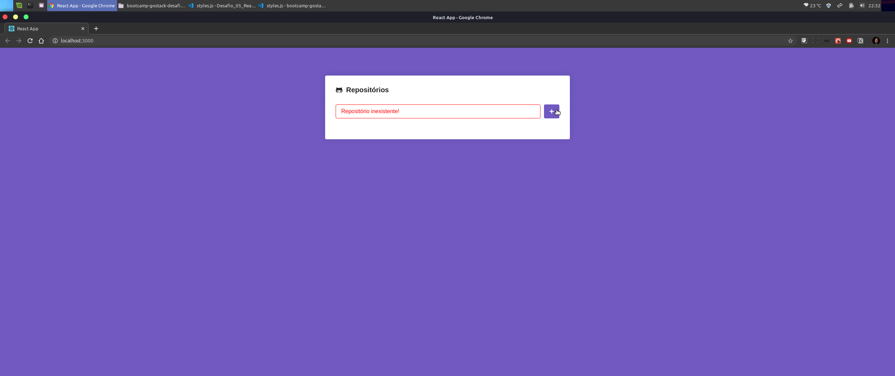
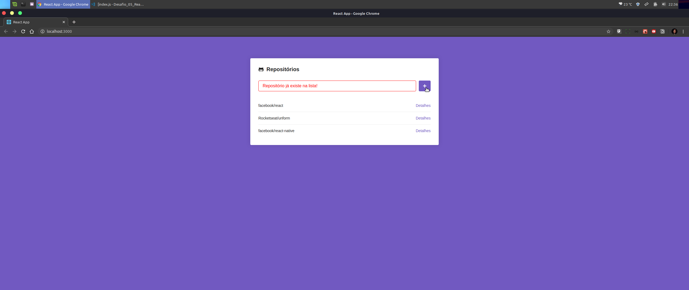
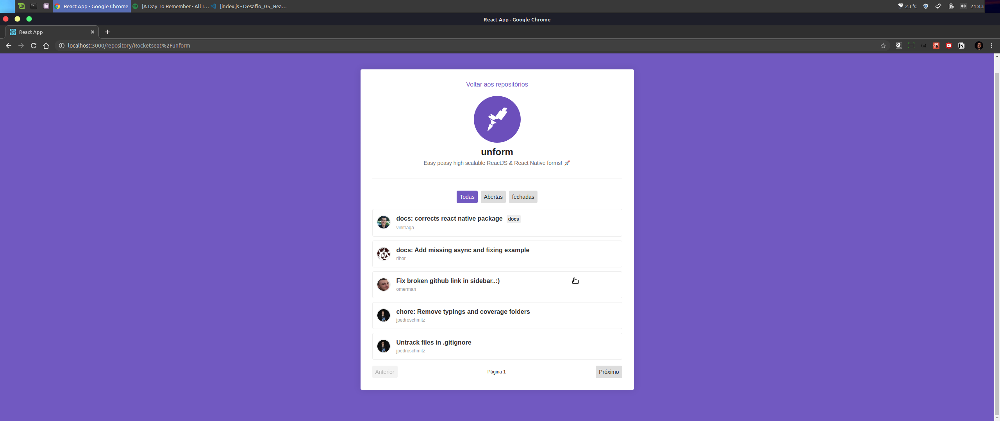
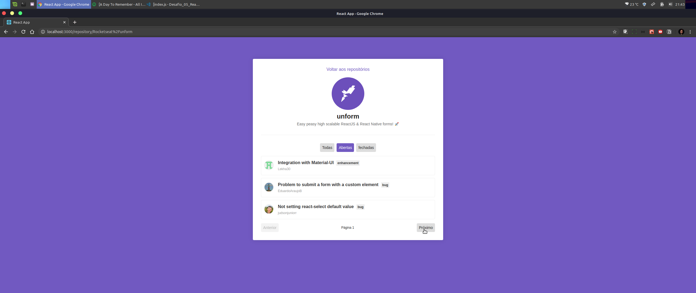
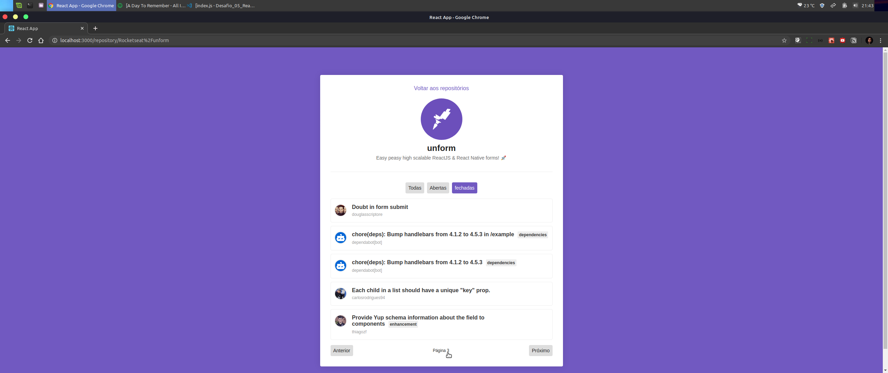

# Desafio 05 em React do GoStack.

Funcionalidades adicionadas:

Verficação de input vazio;
Verificação de repositório existente na lista;
Tags de todas as issues, abertas e fechadas;
Botões de paginação das issues listadas;

Tela da aplicação

 

 

 

 

 

 
